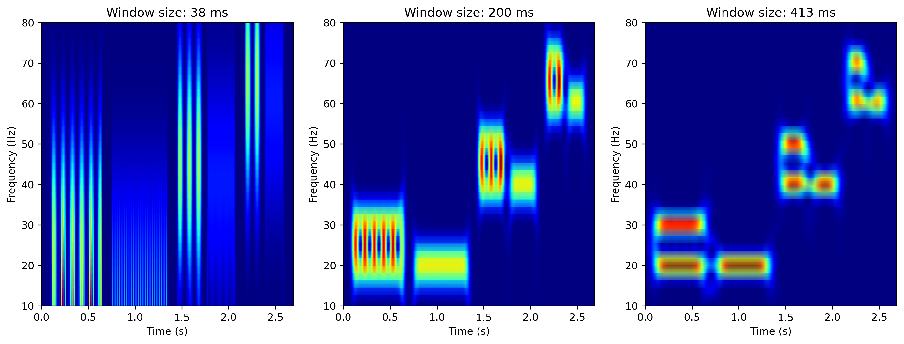
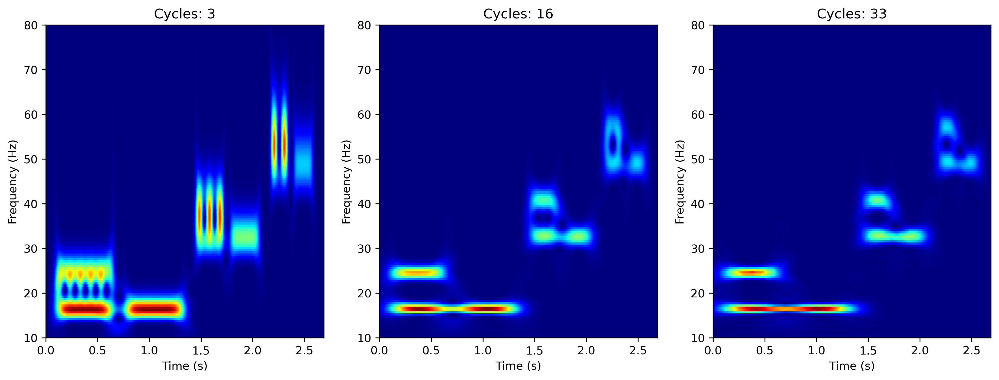
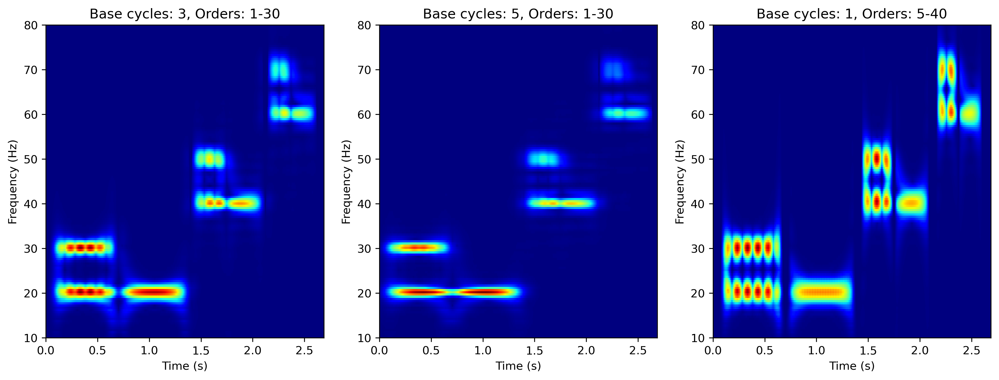

# Superlet-based Time-Frequency Analysis for sEMG

This repository provides a Python implementation of the Superlet Transform (SLT), adapted for surface electromyography (sEMG) signal analysis, as presented in:

**Algaba-Vidoy et al., 2026 (under revision)**  
*Enhanced Time-Frequency Analysis of Surface Electromyography using Superlet Transform*

The implementation is based on the method introduced in:  
Moca et al., 2021 – *Time-frequency super-resolution with superlets* (Nature Communications),  
and builds upon existing open-source implementations by:

- Harald Bârzan & Richard Eugen Ardelean  
  [GitHub repository](https://github.com/TransylvanianInstituteOfNeuroscience/Superlets)  
- Irhum Shafkat  
  [GitHub repository](https://github.com/irhum/superlets)

---

## Overview

Time-frequency (TF) analysis represents how the spectral content of a signal evolves over time. Classical methods such as:

- Short-Time Fourier Transform (STFT)  
- Continuous Wavelet Transform (CWT)  

are subject to the TF trade-off imposed by the Gabor uncertainty principle. The SLT, while not able to completely eliminate this trade-off, is capable of mitigating it by combining wavelets of different cycles into a single representation, improving both time and frequency localization relative to conventional methods.

Until now, SLT has been primarily applied to **electroencephalograms, electrocardiograms, and photoplethysmography signals** signals, which have a reduced frequency content. Moreover, previous studies have largely relied on qualitative evaluation of TF power representations. 

To our knowledge, the SLT has not yet been applied to sEMG signals. These signals are not only inherently noisy but also exhibit power distributed across a wider range of frequencies, reflecting the dynamic recruitment of motor units. Typically, this range goes from 10 to 500 Hz, with most muscle activity concentrated between 20 and 150 Hz. All these characteristics make sEMG signals a particularly challenging test case.

---

## Repository content

This repository provides:

- **An optimized implementation of the SLT**, grounded in the original methodology [Moca et al., 2021], tailored to sEMG signals. The implementation maintains a low computational cost and enables the analysis of longer recordings, making it practical for real applications.
- **A quantitative evaluation framework** of SLT for sEMG time-frequency analysis, addressing the lack of thorough empirical assessment.
- **Support for classical methods** (STFT, CWT) for benchmarking.
- **Spectral feature extraction**: Mean frequency (MNF), Median frequency (MDF), Instantaneos Frequency (IF) and Energy (E).
- **Performance metrics** for systematic assessment, including:
  - Mean Absolute Error (MAE) in time  
  - MAE in frequency  
  - Full Width at Half Maximum (FWHM)
- **Generation of simulated sEMG signals**, enabling benchmarking and controlled experiments with the possibility of **noise modeling and evaluation**:
  - Signal-to-noise ratio (SNR)
- **Option to analyze real sEMG recordings**, allowing direct application to experimental data.
- **Visualization tools** for qualitative assessment of TF power representations.

---

## Demo

A demonstration is included, applying the same approach as in **Figure 3** of the original SLT paper by Moca et al., comparing our sEMG-adapted implementations against the original results. The demo illustrates that our implementations produce comparable results.

### Example visualizations

#### STFT

#### CWT

#### SLT – sEMG based

#### Original SLT

---

## References
Moca, V. V., Bârzan, H., Nagy-Dăbâcan, A., & Mureșan, R. C. (2021). Time-frequency super-resolution with superlets. Nature Communications, 12(1), 337. https://doi.org/10.1038/s41467-020-20539-9

Algaba-Vidoy, M., Corvini G., Gómez-García, J. A., Torricelli, D., Conforto, S. & Moreno, J. C. (2026). Under revision.